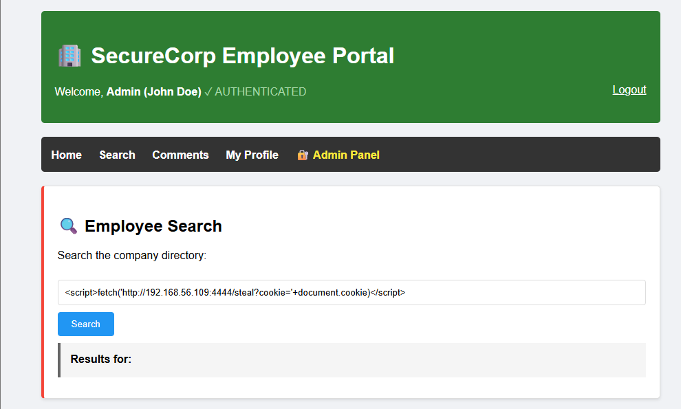
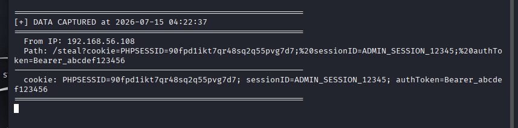
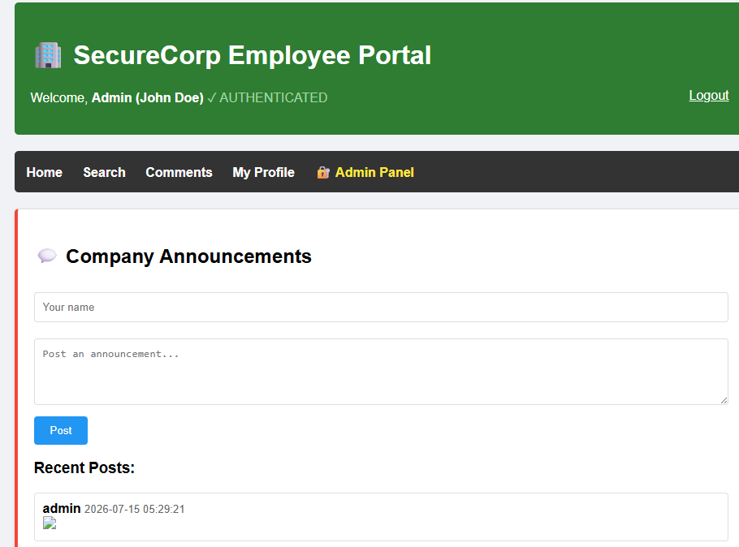
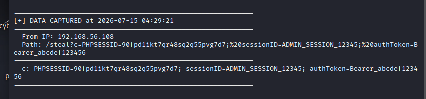
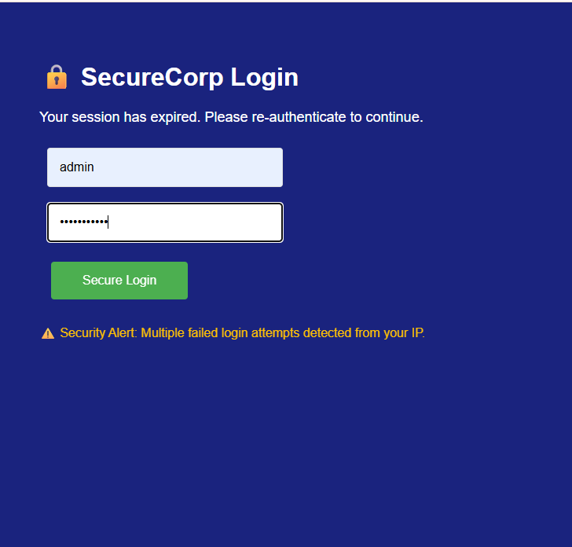
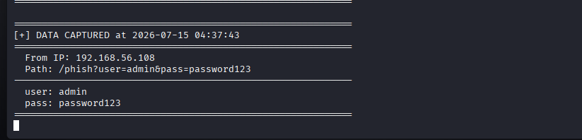
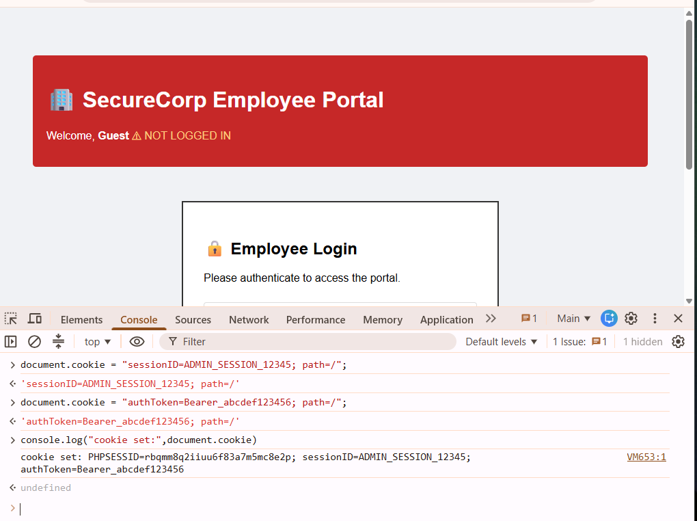

# My First XSS Lab: Reflected, Stored & Fake Login Attack

**By:** Praise Testimony (CyberForge)
**Date:** 15th July 2026

## Disclaimer

This project was built and tested entirely on my own local machine for educational purposes only. No real websites, companies, or people were involved.

---

## What this project is about

I attacked a vulnerable web app from scratch (a fake company portal called SecureCorp) to practice Cross-Site Scripting (XSS). I set it up using XAMPP on my Windows PC, with Kali Linux running in a VM as my "attacker" machine, both connected on the same private network.

The point was to actually see XSS work end to end, not just read about reflected vs stored vs DOM XSS. I found and exploited three things:

1. Reflected XSS in the search bar: stole cookies
2. Stored XSS in the comments section: also stole cookies, but this one saves and fires automatically
3. Used that same stored XSS on a fake login page that steals usernames and passwords

---

## Setup

- Vulnerable app: a PHP site, running on XAMPP (Windows)
- Attacker side: Kali Linux VM, running a small Python script to catch stolen data
- Both machines on the same Host-Only network in VirtualBox so they could talk to each other

I actually got stuck for a bit because Kali couldn't reach the Windows PC, turned out I was viewing the vulnerable site using my wifi IP address instead of the host-only IP, so the payload had no way to reach Kali. Once I switched to the host-only IP, everything worked.

---

## Finding 1: Reflected XSS (Search Page)

**Where:** the search box on the employee search page

**What's wrong:** whatever you type into the search box gets printed straight back onto the page with no filtering. So instead of searching for a name, I can type in actual JavaScript and the browser will run it.

**How I tested it:**
1. Went to the search page
2. Typed in a script tag instead of a name
3. It ran immediately, confirmed the page wasn't cleaning the input at all

**Payload I used:**

This grabs the cookie from whoever's browser it runs in and sends it to my Kali machine.

**Screenshot:**

**Screenshot:**

**Why it matters:** this only works if I can get someone to click a link with this payload baked into the URL, like through a phishing email. But if they click it, I get their session cookie and can log in as them without needing their password at all.

**How to fix it:** the site needs to encode/escape whatever the user types before showing it back on the page, so it displays as text instead of running as code.

---

## Finding 2: Stored XSS (Annocunment Page)

**Where:** the comment box on the announcements page

**What's wrong:** same issue as the search bar, but this time the input gets saved to the server and shown to everyone who visits the page not just me. So I don't need to trick anyone into clicking a link. I just post it once and it runs automatically for anyone who opens that page.

**How I tested it:**
1. Went to the comments page
2. Instead of writing a normal comment, I posted this payload
3. Refreshed the page and the payload fired on its own

**Payload I used:**

This uses a broken image tag on purpose, since the image fails to load, the **onerror** part runs instead, sending the cookie to my Kali box.

**Screenshot:**

**Screenshot:**

**Why it matters:** this is worse than the reflected one because I don't have to send anyone a link. Anyone who just browses to the comments page normally gets hit automatically.

**How to fix it:** same fix as before clean/encode the input before displaying it, every time it's shown, not just when it's typed in.

---

## Finding 3: Fake Login Page (Credential Theft)

**Where:** same comment box, but a much bigger payload

**What's wrong:** since I can already run any JavaScript I want on the page (from the stored XSS bug above), I used that to completely wipe the page and replace it with a fake "your session expired, please log in again" screen that looks just like the real site.

**How I tested it:**
1. Posted this payload as a comment instead of the smaller one
2. Reloaded the page — the whole thing turned into a fake login screen
3. Typed in a test username/password and hit submit
4. Checked my Kali terminal — the username and password showed up there instead of actually logging in

**Payload I used:**

After grabbing the password, it shows a fake "login failed, try again" message so the person doesn't get suspicious, they just think they mistyped it and try again on the real form, not realizing their password already got sent to me.

**Screenshot:**

**Screenshot:**

**Why it matters:** this is the worst one out of the three. Stealing a cookie only gets me in until the session expires. Stealing the actual password means I can log back in anytime, even later, using the real login page.

**How to fix it:** same root cause again — the site needs to stop trusting raw user input and encode it before showing it on the page. A Content Security Policy would also stop this kind of script from running at all, even if the bug is still there.

---

## Logging In Using the Stolen Cookie (DevTools)

Once I had the session cookie from the XSS attacks, I wanted to actually prove it could be used to log in as the admin, not just steal it and stop there.
**How I did it:**
1. Opened the site in my browser
2. Pressed F12 to open Developer Tools
3. Went to the Console tab
4. Pasted this in and hit enter:
    document.cookie = "sessionID=ADMIN_SESSION_12345; path=/";
    document.cookie = "authToken=Bearer_abcdef123456; path=/";
5. Refreshed the page

**What happened:** The site suddenly showed me logged in as admin, no username or password needed. It just checked the cookie value, saw it matched an admin session, and trusted it completely.

**Screenshot:**

**Why this matters:** This proves the stolen cookie isn't just some random data, it's literally the same as having someone's password, at least until that session expires. The site has no way to tell the difference between the real admin logging in and me just pasting their cookie into my own browser.

**How to fix it:** Cookies should be tied to more than just their value — things like checking the IP address hasn't changed, adding short expiry times, and using **HttpOnly** + **Secure** flags so the cookie can't even be read or copied via JavaScript in the first place.

---

## What I learned overall

All three bugs come from the exact same root problem: the site takes what a user types and shows it back on the page without cleaning it up first. Fix that one thing properly and all three attacks stop working.

I also learned that reflected and DOM XSS actually need the attacker to trick someone into clicking a link but stored XSS doesn't need that at all, it just fires for anyone who visits the page normally. That's why stored XSS gets treated as more dangerous.

Honestly the trickiest part of this whole project wasn't even the XSS part — it was getting my Kali VM and Windows host to actually talk to each other over the network.

---

## Tools I used

- XAMPP (Apache + PHP) on Windows
- Kali Linux in VirtualBox
- A small Python script to catch the stolen cookies/passwords
- Browser DevTools to check things were actually firing
